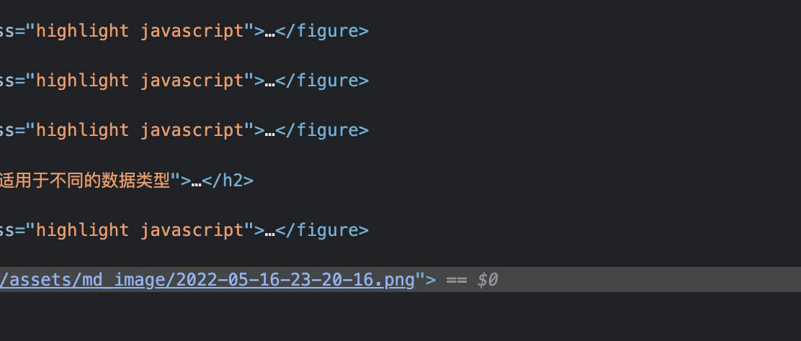

# for in 与 for of 有什么区别

## key value

-   `for ... in` 遍历得到 key
-   `for ... of` 遍历得到 value

```javascript
const arr = [10, 20, 30];
for (let val of arr) {
    console.log(val);
}
```

`for ... of` 可以遍历函数的 `arguments`

```javascript
function fn() {
    for (let arg of arguments) {
        console.log(arg);
    }
}
```

`for ... of` 可以遍历 `NodeList`

```javascript
const pList = document.querySelectorAll('p');
for (let p of pList) {
    console.log(p);
}
```

---

## 两者适用于不同的数据类型

-   遍历对象： `for ... in` 可以，`for ... of` 不可以
-   遍历 Map Set：`for ... of` 可以，`for ... in` 不可以
-   遍历 generator: `for ... of` 可以，`for ... in` 不可以

```javascript
const obj = {
    name: '臭豆腐',
    city: '北京',
};

for (let val of obj) {
    console.log(val);
}
```


